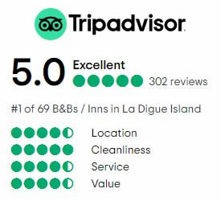
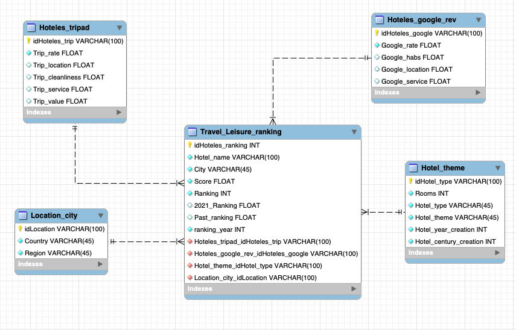
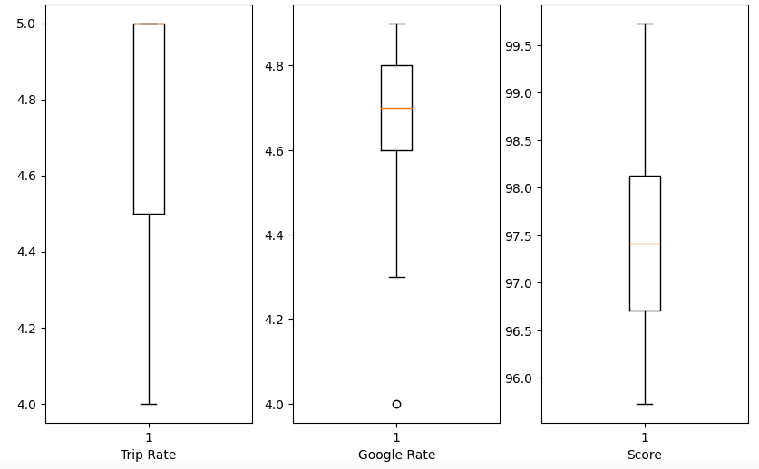
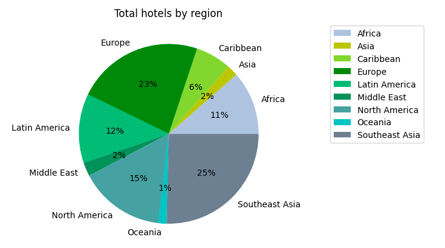

# Project_Jan22_Hotels

 

## OBJECTIVE
---
To demonstrate and put into practice everything learned in *Ironhack* during the first part of the bootcamp I present the following project.

The project I have chosen consists of analyzing and contrasting the ranking of the 100 best hotels of 2022 and 2021 proposed by Travel and Leisure magazine.

- What is **Travel+ Leisure?** 

Travel and Leisure is a magazine and website that focuses on travel, food, and lifestyle topics. It provides readers with information and inspiration for planning trips, discovering new destinations, and experiencing the best in dining, shopping, and culture around the world. It also covers topics such as home design, wellness, and travel news. 

The magazine is published monthly and the website is updated regularly with articles, photos, and videos.It's  based in New York City, New York and has 4.8 million readers, according to its corporate media kit.

## Project development
____
### **1. Data set**

I have extracted the data set from Kaggle Data Sets.

In the following link you will have access to the original data set: https://www.kaggle.com/datasets/narmelan/travelleisure-worlds-best-hotels-2022

the original data base provides the following information: 
- Name of the hotels :Hotel	
- City where the hotel is: Location	
- Country where the hotel is: Country
- Region where the hotel is: Region	
- Company owner: Company	
- Score given (out of 100): Score	
- Ranking position, going from 1 (top hotel) to 100: Rank	
- Number of rooms of the hotel: Rooms	
- General setting : Theme	
- Year built: Year

### **2. Cleaning**

In the document *Clean_hotels_2022* the following is done:

Cleaning of the csv data of the 2022 TL ranking. I do the same analysis for the 2021 data. Then, I join the two rankings with the cleaned data in the same csv (2022 + 2021). 

The original database is quite clean, there are no zero values or missing information for certain hotels.
In the same document I do an exploration of the data to understand well the database. However, I do add columns to be able to perform a more concrete and exhaustive analysis later.

### **3. Extraction**

The next step of the project is to perform a data extraction by Web Scraping, using *Selenium* to interact with web browsers and perform actions such as clicking buttons, filling out forms, and navigating between pages.

In this phase of web escraping I thought it appropriate to do it by extracting information from two web pages.
First, I created a dataframe which contains the hotels (uniques), eliminating the repeated ones, as some of them were in both rankings), so that the extraction would be faster, in total I have o do the scrapping for 178 hotels. Once I have the hotels I decided to start the scraping with **Tripadvisor**.

TripAdvisor is a website and mobile app that provides reviews, ratings, and photos of travel-related content such as hotels, restaurants, and tourist attractions. It allows users to plan and book their trips, and provide feedback on their experiences. TripAdvisor has a large user base and contains a wealth of user-generated content, including reviews, photos, and videos. It is considered as one of the largest travel website in the world.

For the tripadvisor scraping I *write* the hotel in the search engine of the web: https://www.tripadvisor.es/ and then I extract the rating that the users give it as follows the total rate, the location, the cleanliness, service and value score.

I then decided to also extract information from another web page, so that the information would be more complete and I could contrast it better. The scraping was done from **Google reviews**.

Google reviews are user-generated ratings and comments that can be found on Google search, maps and on a business's Google My Business profile. These reviews can be left by anyone who has had an experience with a business and are intended to provide potential customers with information about the quality of the business's products or services. Google reviews are typically used to evaluate the reputation of a business, and can be helpful for others who are considering using the business.

This second scan does not work in the same way as the previous one, in order to perform the extraction and make sure that the hotels I put in the search engine are the ones corresponding to the ones in the data set, I put the word "hotel" followed by the name of the hotel in the google search engine: https://www.google.com/ . Once I have the hotel I select/extract the following information: the total rate, the reviews about the rooms, the location and the services.

Once I have the extraction of both web pages I verify that it has been done correctly and complete the information with the .loc() for the hotels in which the extraction median selenium has not worked. The extraction did not always work because the page layout changed, for example in case a hotel was closed. In other cases, there was no certain information so I decided to leave it empty.

### **4. SQL**

I have decided to upload the SQL database in order to relate and draw further conclusions and see if the hotels are really well rated by the users.

First I have created the tables in SQL where I want to include the information. In such a way that it looks like this:

There are 5 tables, two of them are composed of the databases created from the trip advisor and google reviews scan. The other three are the clean and completed csv data from Travel + Leisure. I have created three tables divided by theme, in one the location, another one the hotel characteristics and in the main one that contains the foreign keys all the rest corresponding to the hotels.

The next step is to upload the information to SLQ, the code to upload the information through alquemy is in the following file *Upload_BBDD*. 

When uploading the data I had to replace the Nan with 0 since it caused me a problem. Replacing them is not a problem since the only data that contains 0 are the Nan.

Once we have the database in sql we can begin to analyze and contrast the information offered by Travel + Leisure with that of Google reviews and Tripadvisor

### **5. Conclusions**

In the following document called *Conclusions* I do the visualization, analysis and comparison of the hotel data.

Thanks to the visualization, I have been able not only to draw the following conclusions, but it has also helped me to see if there was missing or erroneous information about the scraping.

As we can see, in Trip Advisor the majority of the hotels have a the highest rate (5), in Google Reviews the score is more diverse and it's less concentrate than in TripAdvisor and in Travel + Leisure the score is more precise and more widely distributed. There are 74, with do NOT have the maximum rate of Tripadvisor. There are 165, which do not have the maximum rate of Google Reviews.

The best hotels are according to Travel and Leisure are located:

Of the 5 best hotels of the ranking proposed by the magazine, we can draw the following conclusions:
-  all the hotels have a good score, both on google and tripadvisor. 
- the general score on trip advisor is 5, they are very well rated, with the highest score. 
    - However if we look more in detail the valuation on the price quality (column trip_value) that they give to the top 5 is not so high, reaching 4.4 so we can say that they are hotels with a very high cost.
    - The score given by google reviews is not so much in line with that of TL, none of the top 5 hotels has the highest score (4.9), but none has less than 4.5.
- We can also say that the google and trip ratings are not the same because of the top 5 Capella Ubud is one of the best rated by trip but in google reviews has ratings below 4 (to be one of the best hotels in the world this score is not so accurate).

Of the 5 best hotels of the ranking proposed by the magazine in 2021, we can draw the following conclusions:
- all the hotels have a good score, both on google and tripadvisor. 
- in Tripadvisor all the hotels are very well rated, with the maximum score in general and in more detail all the ratings are high, the worst with a 4.8
- the score given by google reviews varies more with respect to tripavisor but also receive good scores.

**It should be noted that despite the not so good ratings in google reviews the hotel Capella Ubud appears both years in the top 100 of the best hotels and in both years in the top 5 according to TL.**

Within the 100 hotels proposed by TL, let's see if users really think the same and which are the best rated on both platforms. 

None of the hotels on tripadvisor has in all rating categories the highest score of 5. In Tripadvisor none of the hotels has the highest score in terms of value for money (trip_value), so let's find out which is the best hotel filtering by the rest of variables. The **Capella Hanoi** hotel is the best hotel among the 100 proposed by TL acording to Tripadvisor users. Of the hotels proposed by TL magazine, we can say that tripadvisor users have a similar opinion and give them a high score. It should be noted that several hotels such as Mahali Mzuri and Capella Ubud consider tripadvor hotels as very good and are in the top 5. In fact Capella Ubud is in the top 100 best hotels according to TL both years.

In google reviews we will discard for this conclusion the hotels which have no rating in the different categories (which are at 0). The **Angama Mara** hotel could be consider as one of the best hotels in google reviews even if the general rate is not 5 but all the other scores reveal that has maximum scoring.
From the google reviews the best hotels are the following: Mashpi Lodge, Nayara Tented Group, Nayara Tented Camp, Lion Sands Game Reserve, Nayara Gardens, The Loutrel and One&Only Reethi Rah. All the hotels proposed by the magazine have high scores according to google reviews users. Moreover, we can see how the Nº1 of the 2021 ranking is in the top 5 of the google reviews. However, not all the hotels in the top 5 of google (from this extraction) have the highest score, there are some that have a worse score according to the magazine.

## Future steps
----

As future objectives it would be interesting to make a comparison with more databases such as booking or/and airbnb and see if other users really have the same opinions and later make a comparison of user opinions.

It would also be interesting to see what the users think about the hotels that are repeated both years in the magazine and to analyze the comments, both good and bad.

## Libraries
----

- [Pandas](https://pandas.pydata.org/)
- [Numpy](https://numpy.org/)
- [Folium](https://python-visualization.github.io/folium/)
- [Dotenv](https://pypi.org/project/python-dotenv/)
- [Selenium](https://www.selenium.dev/)
- [Datetime](https://docs.python.org/3/library/datetime.html)
- [Sqlalchemy](https://www.sqlalchemy.org/)
- [Sys](https://docs.python.org/3/library/sys.html)
- [Matplotlib](https://matplotlib.org/)
- [Requests](https://requests.readthedocs.io/en/master/)
- [Seaborn](https://seaborn.pydata.org/)
- [Plotly Express](https://plotly.com/python/plotly-express/)

## Folders
----

Data: *Contains the csv's that I have been generating throughout the work.*

images: *Contains the files (images) to insert in the jupyters*

Notebook: *Contains the files (Jupyter notebooks) where the code is*

SQL: *Contains the files I have generated with sql*

src